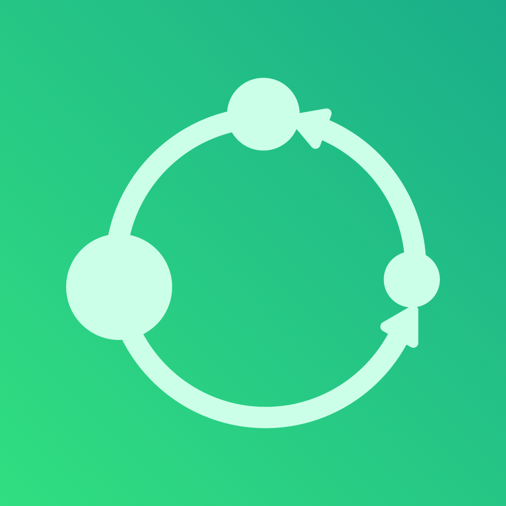

# Circuls

**Aleph Hackathon March '25**

## The Problem

Our mission is to build tools of mass restoration for nature, and we’re kicking things off with a focus on recycling.

We discovered a proven solution that increases recycling rates, reduces litter, and makes a profit: the Deposit Return Scheme. You pay a small deposit when you buy soda, then return the container on the supermarket and get the deposit back. It’s been super successful in Europe, but it rely's on reverse vending machines that are expensive and setting them up takes a ton of effort (often dragging in the government).

To solve this problem, we decided to digitize the entire deposit system —no expensive machines, just an app that tracks every container, fights fraud, and makes it feasible for communities and countries from LATAM to adopt a deposit return scheme.

## Productive Demo Links

We have our WorldCoin MiniApp Demo available on the World App: [Link Here!](https://worldcoin.org/ecosystem/app_f30a4a2206cb661cd4ea1b126939601c)

You can access additional functionality on our Web App:

- Producer containers generator: [Link Here!](https://circuls-aleph-hackathon-march-25.vercel.app/backoffice/producer) - You can generate a batch of containers ids with associated deposits (then the user can return them and get the deposit back).

- Recycling center validator: [Link Here!](https://circuls-aleph-hackathon-march-25.vercel.app/backoffice/validator) - You can validate a container id and release the deposit back to the user.

We have our contract deployed on World Chain Mainnet, you can check it on the World Explorer: [Link Here!](https://worldscan.org/address/0x76aFD8E56201A75D7C427424A074A99258C8aD6a).

## How it works?

Our solution is a digital deposit return system that leverages unique container IDs to ensure traceability and fair rewards. The high-level idea is that beverage producers generate unique codes (QR) for each container, deposit the required amount (in either WorldCoin or a custom token), and consumers earn a reward upon returning containers for recycling.

### Business Model & Treasury

To understand the business model of this project, it is necessary to understand how the treasure moves. Below is a graphic that shows, step by step, the flow of treasure among the network's actors, based on deposit return scheme systems successfully executed in Europe.

### System Architecture

Below is an overview of this demo components, illustrating how each actor interacts:

1. **Producers**: Register each new container in the platform by generating and storing a unique code on-chain. They also deposit the corresponding reward (or “Circoins”) in a smart contract. In a real system, the user would pay this deposit when purchasing the product, but for the hackathon, we’ve assumed producers will fund the deposit upfront.
2. **Consumers**: Use our WorldCoin MiniApp to scan both the recycling bin (Circul Bin) QR code and the container’s QR code, thereby initiating the recycling process and locking their rewards until validation.
3. **Recycling Centers**: Validate incoming containers (manually or via computer vision in the future) and confirm the correct deposit of items. Upon validation, the rewards are released to the consumer’s wallet. On this demo, we have a backoffice interface for recycling centers to manually validate containers.

#### Backoffice

For demo purposes, we’ve built a backoffice interface to simulate the [producer](https://circuls-aleph-hackathon-march-25.vercel.app/backoffice/producer) and [recycling center](https://circuls-aleph-hackathon-march-25.vercel.app/backoffice/validator) roles. This interface allows producers to generate container IDs and deposit rewards, while recycling centers can validate containers and release rewards. In a real-world scenario, these actions would be automated or integrated with existing systems.

| Producer Interface | Recycling Center Interface |
| --- | --- |
|  |  |

### User Flow

For our demo, we’ve focused on the core user journey, from sign in and onboarding to reward release. Here’s a step-by-step overview of the process:

1. **Onboarding**: Users learn how deposits work and how to earn rewards by scanning containers.
2. **Sign In**: Users log in to the WorldCoin MiniApp using their World ID.
3. **Scan Process**: Users scan a “Circul Bin” QR to confirm the recycling location, then scan each container’s QR.
4. **Pending Transaction**: The contract locks the reward for each container until the recycling center verifies it.
5. **Validation**: An operator or automated system confirms the container is valid.
6. **Reward Release**: The user’s tokens are unlocked and appear in their wallet.

## Future Tech Roadmap

This is a demo prototype, built over a weekend. However, the idea behind this product is contagious, and our team is determined to continue developing it after the hackathon to bring it to life. With that in mind, here are some technical considerations for the project's future:

- **WLD Payments:** For demonstration purposes, we've managed user balances as numeric values in a contract. In a production system, we plan to use WLD both for storing container deposits and for paying users.
- **FIAT Payments:** Given the project's scope—which aims to serve everyone in a city regardless of technical background—we will integrate a solution that allows users to convert their Circoins into FIAT directly into their bank accounts. We already have potential partner projects available in the World app for this conversion.
- **Nationality Verification:** We will utilize WorldCoin’s nationality feature to ensure that our users access the application only from the countries where we offer support.
- **Scalability:** We intend to separate token management into an ERC-20 contract, representing Circoins as fungible tokens, while keeping the traceability and deposit logic in separate contracts.
- **Data Storage:** While this demo currently lacks a backend, in the future we plan to implement off-chain storage for additional user and container data, aiming for a more efficient and flexible data retrieval system.
- **Metrics:** By combining an off-chain database with on-chain data validation, we will be able to compute real and transparent impact metrics for our users and for every actor in the recycling value chain, including producers and recycling centers.

### Future Product Roadmap

- **User Incentives:** In future iterations, we aim to offer a wider variety of redemption options for Circoins—such as crowdfunding, donations, FIAT conversion, or cashback at retail outlets like supermarkets.
- **Gamification:** We are considering gamification strategies with goals, badges, and tiers to boost engagement and increase recycling participation.
- **Batch Redemption Model:** In some regions or with certain producers, uniquely identifying each container might be challenging. To maximize reach, we are also working on a more relaxed traceability model for batch-based recycling. This approach will ensure anti-fraud validation, but adding enhanced protective measures that might occasionally result in lower rewards for honest users within communities susceptible to fraudulent behavior. Although this restriction, this scheme will still be more effective and profittable for the users than the current recycling system.
